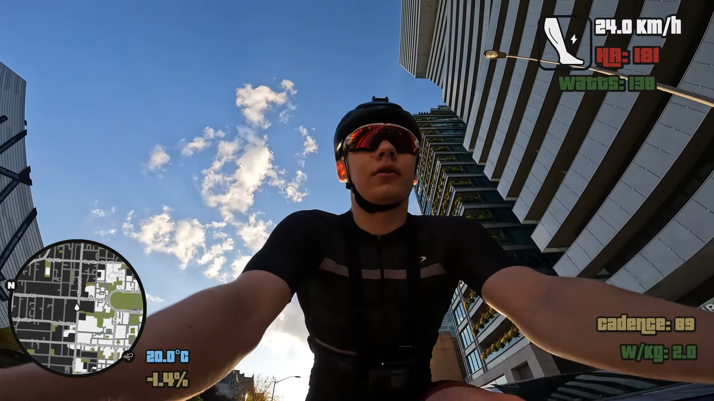

# Templates

Community templates are browsable and installable directly from within Cyclemetry via **Templates → Select Template…**.

<!-- SHOWCASE_START -->

| Template | Preview |
| --- | --- |
| **Aaron** |  |
| **Crit** |  |
| **GTA** |  |
| **Jeff** |  |
| **NorCal** |  |
| **Safa** |  |
| **Will** |  |

<!-- SHOWCASE_END -->

## Folder structure

Each template lives in its own subdirectory named with lowercase snake_case:

```
templates/
  my_template/
    my_template.json   ← overlay configuration
    preview.jpg        ← 1920×1080 preview screenshot (required)
    README.md          ← showcase metadata, credits, and notes
```

Each public template must include a `README.md`. The folder README is the single source for display name, showcase preview, and optional inspiration credits used by both this README and the website templates page. The JSON filename must match the folder name exactly.

Template README format:

```md
# My Template

## Inspiration

- [Creator video title](https://www.youtube.com/watch?v=...)

## Preview


```

## Submitting a template

1. **Fork** the repository and create a branch.
2. Create a new folder under `templates/` using lowercase snake_case (e.g. `templates/my_template/`).
3. Add your template JSON at `templates/my_template/my_template.json`.
4. Add a `preview.jpg` — a 1920×1080 screenshot of the overlay rendered over a real activity. This is required; templates without a preview won't appear in the in-app browser.
5. Add a `README.md` inside your folder. Use the H1 for the display name, include the preview image, and add an `## Inspiration` section if the design was inspired by a video.
6. Optionally include your name/handle, a description, and any notes about which activity types or data fields the template expects.
7. Open a **pull request** against `main`. Include a brief description of the template and link to any video it was designed for.

Templates are reviewed for correctness (valid JSON, reasonable field names) and that the preview accurately represents the overlay. Once merged they are immediately available to all users via the in-app browser.

## JSON schema

See [CLAUDE.md](../CLAUDE.md) for a high-level overview of the app architecture. A full schema reference is planned — for now, use an existing template as a starting point and adjust field values.
