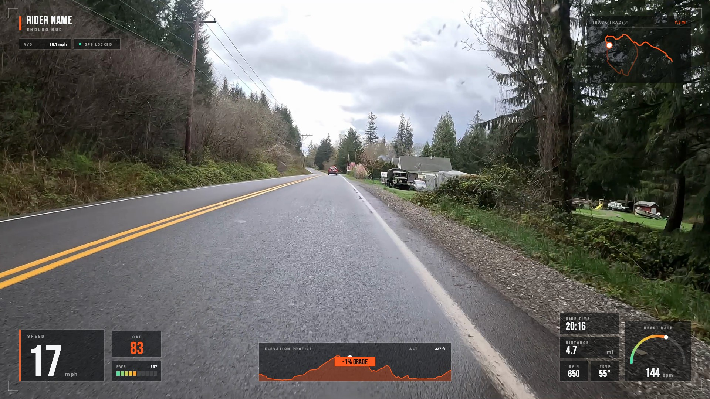

# Enduro HUD

An instrument-panel overlay in the style of an enduro race HUD: translucent
smoked-glass panels with hairline borders, corner registration ticks, and a
single orange accent running through the whole layout.

Reads clockwise from the top left — a course-progress bar with W/kg and
altitude chips, GPS track trace, heart-rate dial with ride stats, elevation
profile with a floating grade badge, and a large speed readout paired with
cadence and a segmented power bar.

Every readout is live: nothing on the overlay holds a whole-ride constant except
the course total in the trace header, paired with the distance covered so far.

## Design

Adapted from an "Enduro HUD Overlay" concept designed for motorcycle
chest-cam footage. The moto-specific readouts were remapped to their cycling
equivalents:

| Original | Here |
| --- | --- |
| Gear | Cadence |
| RPM redline bar | Power (segmented, auto-scaled to the ride's max) |
| Lean-angle dial | Heart-rate dial (60–200 bpm) |
| G-force | W/kg |
| Stage counter | Course-progress bar |

## Notes

- Authored at 4K (3840×2160) and scaled to the chosen output resolution.
- Units follow the app's unit setting, not the template — the speed and
  distance captions are `unit_of` labels, so they rewrite themselves
  (`mph`→`km/h`, `mi`→`km`) when you flip between imperial and metric. The
  `bpm` caption is static, since heart rate reads the same in both systems.
- Best results with a file carrying heart rate, power, and cadence. Missing
  metrics leave their panel blank rather than breaking the layout.
- The **W/KG** chip needs a rider weight set in the app's settings — without one
  it reads `0.0`. Swap that chip's metric if you'd rather not set a weight.
- The progress bar in the top left is a `distance` meter spanning the ride
  (`min`→`max`), so it fills left to right exactly once over the overlay window.
- **GAIN** / **DROP** are `running_elevation_gain` / `running_elevation_loss`:
  they count up as you climb and descend rather than showing the ride total.
- Colors are driven by `scene.vars` — change `accent` to re-theme the entire
  overlay in one edit.

## Preview

